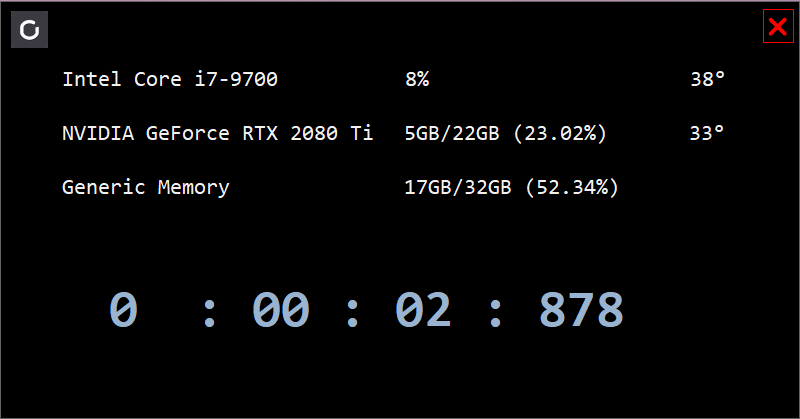

V2

&nbsp;

V1

# CpuGpuTemper
A small and cute CPU/GPU/MEMORY monitor

##base on 
- .net 7.0
- LibreHardwareMonitorLib (https://github.com/LibreHardwareMonitor/LibreHardwareMonitor)

## Features
- 🌟 Monitor temperature and hardware occupancy
- 🆒 As top window, modern ui design
- 🔥 A small timer, suitable for stable diffusion
 

## Useage
1.  Drag the window  
    Click and drag the empty area of cpu/gpu/memo, not the timer. 

2. Start/Stop the timer  
    click the big number, or the space around the big number, not far.

3. Rest the timer  
    just double click the big number or around the space.

## License
CpuGpuTemper is free and open source software licensed under MPL 2.0. You can use it in private and commercial projects. Keep in mind that you must include a copy of the license in your project.